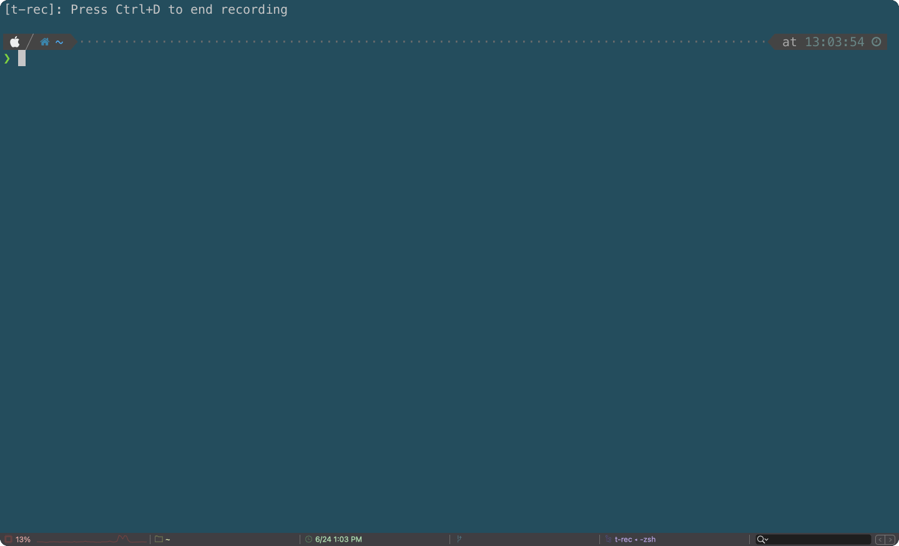

## (DOING) Rooting : CLI App
I'm gonna make this until August
## *TL; DR*
If you are like this
```shell
$ pwd
> /root/dirA/dirB/dirC/dirD/.../HERE
```
and wanna go '/root/dirA', you may struggle to do this.
```shell
$ cd ..
> /root/dirA/dirB/dirC/dirD/.../dirX/dirY/dirZ/HERE
$ cd ..
> /root/dirA/dirB/dirC/dirD/.../dirX/dirY/HERE
$ cd ..
> /root/dirA/dirB/dirC/dirD/.../dirX/HERE
.
.
.

```
It's a pain in the neck..., isn't it?

## PREVIEW(incomplete)

